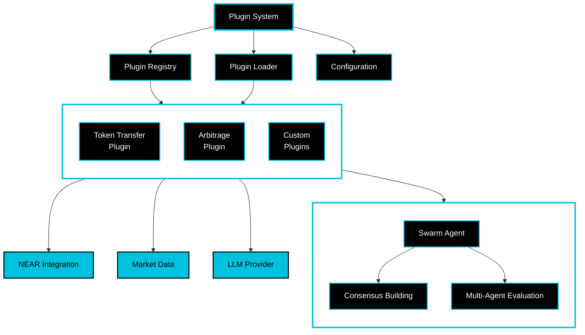

# NEAR AI Agent Studio

A production-ready starter kit for building AI agents and multi-agent swarms on NEAR. This template provides the essential building blocks for creating autonomous agents that can interact with the NEAR blockchain, make decisions using LLMs, and collaborate in swarms.

[](https://opensource.org/licenses/MIT)
[](https://near.org)
[](https://github.com/near/near-ai-agent-template/actions)
[](https://www.python.org/downloads/)
[](https://pypi.org/project/near-swarm/)
[](https://hyperbolic.xyz)
[](https://www.lavanet.xyz/get-started/near)

## Table of Contents
1. [Overview](#overview)
2. [Features](#features)
3. [Getting Started](#-getting-started)
4. [Core Components](#-core-components)
5. [Interactive Features](#-interactive-features)
6. [Examples](#-examples)
7. [Documentation](#-documentation)
8. [Contributing](#-contributing)

## Overview

The NEAR AI Agent Studio is an educational and interactive starter kit designed for developers looking to build AI-powered applications on NEAR. It combines three powerful paradigms:
- 🧠 Multi-agent swarm intelligence for collaborative decision-making
- 🗣️ Voice-powered agents for portfolio management and market analysis
- 💬 Interactive chat with autonomous agents for onchain actions

## 🔥 Features

### 🧠 Swarm Intelligence

Swarm intelligence enables multiple specialized agents to collaborate for better outcomes:

- **Market Analyzer** agents evaluate price data and trading volumes
- **Risk Manager** agents assess potential risks and exposure
- **Strategy Optimizer** agents fine-tune execution parameters

These agents work together through:
1. Expertise-based evaluation
2. Confidence scoring
3. Transparent reasoning
4. Consensus building

### 🎙️ Interactive Voice Assistant

Natural language interaction with your NEAR portfolio:
- Real-time market analysis and insights
- Portfolio balance monitoring
- Transaction history tracking
- Voice-powered trading suggestions
- Market sentiment analysis

### 🤖 Multi-Agent Strategy

Watch specialized AI agents collaborate in real-time:

1. **Market Analysis Phase**
   - Price trend evaluation
   - Volume analysis
   - Market sentiment assessment
   - Network monitoring

2. **Risk Management Phase**
   - Transaction risk assessment
   - Portfolio exposure analysis
   - Network security validation
   - Gas optimization

3. **Strategy Optimization Phase**
   - Parameter fine-tuning
   - Execution timing
   - Slippage prediction
   - Cost-benefit analysis

4. **Consensus Building**
   - Multi-agent voting
   - Confidence scoring
   - Detailed reasoning
   - Transparent decisions

## ⚡️ Getting Started

### Prerequisites

Before you begin, ensure you have:

#### System Requirements
- Python 3.12 or higher
- Git
- Operating System:
  - macOS 12.0+
  - Ubuntu 20.04+ / Debian 11+
  - Windows 10/11 with WSL2

#### NEAR Account
- NEAR testnet account (created automatically by [quickstart](./scripts/quickstart.sh) script)
- Or existing account with:
  - Account ID
  - Full access key
  - Test NEAR tokens (available from [NEAR Faucet](https://near-faucet.io))

#### API Keys
- Hyperbolic API key for LLM capabilities
  - Sign up at [hyperbolic.xyz](https://hyperbolic.xyz)
  - Free tier available for development
- ElevenLabs API key for voice features (optional)
  - Register at [elevenlabs.io](https://elevenlabs.io)
  - Free tier includes basic voice synthesis

### Quick Start
```bash
# Clone the repository
git clone https://github.com/jbarnes850/near-ai-agent-studio
cd near-ai-agent-studio

# Create and activate virtual environment
python -m venv venv
source venv/bin/activate  # On Windows: .\venv\Scripts\activate

# Install dependencies
pip install -e .

# Run the quickstart script
chmod +x scripts/quickstart.sh  # Make script executable
./scripts/quickstart.sh
```

### Environment Setup
```bash
# Copy environment template
cp .env.example .env

# Edit .env with your credentials
# Required variables:
# - NEAR_ACCOUNT_ID=your-account.testnet
# - NEAR_PRIVATE_KEY=your-private-key
# - LLM_PROVIDER=hyperbolic
# - LLM_API_KEY=your-api-key
# Optional:
# - ELEVENLABS_API_KEY=your-key  # For voice features

# Verify installation
near-swarm config validate
```

### Running Demos
```bash
# Run all demos
python near_swarm/examples/demo.py all

# Run specific components
python near_swarm/examples/demo.py voice    # Voice assistant
python near_swarm/examples/demo.py strategy # Multi-agent strategy
python near_swarm/examples/demo.py chat    # Interactive chat

# Create your first agent
near-swarm create agent my-agent
near-swarm plugins list  # View available plugins
```

### Troubleshooting

If you encounter any issues:

1. Ensure all dependencies are installed:
```bash
pip install -e ".[dev]"  # Install with development dependencies
```

2. Verify your Python version:
```bash
python --version  # Should be 3.12 or higher
```

3. Check your configuration:
```bash
near-swarm config show  # View current configuration
```

4. Common issues:
- "Command not found": Ensure virtual environment is activated
- Import errors: Verify installation with `pip list`
- API errors: Check your API keys in `.env`
- Git errors: Install git with `apt install git` or `brew install git`

## Core Components

> **Tip**: Start with modifying the examples in `near_swarm/examples/` to understand the framework.

> **Note**: This template runs on NEAR testnet by default for safe development.
> Always test thoroughly before deploying to mainnet.

### System Architecture



The architecture combines a flexible plugin system with swarm intelligence capabilities:

1. **Plugin System Core**
   - Plugin Registry for managing available plugins
   - Plugin Loader for dynamic loading/unloading
   - Configuration management with validation

2. **Core Services**
   - NEAR Protocol integration
   - Market data feeds
   - LLM provider interface

3. **Agent Plugins**
   - Token Transfer plugin for NEAR transactions
   - Arbitrage plugin for market opportunities
   - Custom plugins for specialized strategies

4. **Swarm Intelligence**
   - Swarm Agent for coordinated decision-making
   - Consensus building through multi-agent voting
   - Role-based evaluation with LLM reasoning

This architecture enables:
- Easy extension through plugins
- Coordinated decision-making via swarm intelligence
- Secure transaction handling
- Market-aware operations
- LLM-powered reasoning

### Project Structure
```bash
near-swarm-intelligence/
├── near_swarm/              
│   ├── core/               
│   │   ├── agent.py       
│   │   ├── swarm_agent.py 
│   │   ├── llm_provider.py 
│   │   ├── near_integration.py 
│   │   └── config/        
│   │       ├── agent_roles.json 
│   │       └── swarm_config.json 
│   └── examples/         
│       ├── simple_strategy.py 
│       └── arbitrage_strategy.py 
├── scripts/              
├── tests/               
└── docs/                
```

## 🛠️ Development Guide

### Creating Your First Agent

```python
from near_swarm.core.agent import Agent, AgentConfig
from near_swarm.core.swarm_agent import SwarmAgent, SwarmConfig

# Configure your agent
config = AgentConfig(
    near_network="testnet",
    account_id="your-account.testnet",
    private_key="your-private-key",
    llm_provider="hyperbolic",
    llm_api_key="your-api-key"
)

# Create and start agent
agent = Agent(config)
await agent.start()

# Execute actions
result = await agent.execute_action({
    "type": "transaction",
    "params": {
        "receiver_id": "receiver.testnet",
        "amount": "1.5"
    }
})
```

### Creating a Swarm

```python
# Create swarm configuration
swarm_config = SwarmConfig(
    role="market_analyzer",
    min_confidence=0.7,
    min_votes=2,
    timeout=1.0
)

# Initialize swarm agents
main_agent = SwarmAgent(config, swarm_config)
peer_agent = SwarmAgent(config, SwarmConfig(role="risk_manager"))

# Form swarm
await main_agent.join_swarm([peer_agent])
```

## 📚 Interactive Features

### Voice Commands
- Portfolio queries
- Market analysis
- Transaction requests
- Strategy suggestions

### Chat Commands
- Market Analysis
  ```bash
  /market [symbol]  # Get market analysis
  /trend [timeframe]  # Get trend analysis
  /volume [symbol]  # Volume analysis
  ```

- Risk Management
  ```bash
  /risk [action]  # Risk assessment
  /balance  # Check portfolio balance
  /positions  # List open positions
  ```

- Strategy
  ```bash
  /strategy [action]  # Strategy suggestions
  /portfolio  # Portfolio overview
  ```

- Development Tools
  ```bash
  /ws  # Manage workspace
  /env  # Configure environment
  /config  # View/modify settings
  ```

## 📄 Examples

For more examples and reference implementations, check out our [examples directory](near_swarm/examples/):

- [`arbitrage_strategy.py`](near_swarm/examples/arbitrage_strategy.py) - Advanced DEX arbitrage
- [`demo.py`](near_swarm/examples/demo.py) - Interactive demo of all features

Each example includes detailed comments and demonstrates different aspects of the framework.
See our [Examples Guide](docs/tutorial.md) for detailed walkthroughs.

## 📖 Documentation

- [Core Concepts](docs/core-concepts.md)
- [First Strategy](docs/first-strategy.md)
- [Tutorial](docs/tutorial.md)
- [Troubleshooting](docs/troubleshooting.md)

## 🤝 Contributing

We welcome contributions! Please see our [Contributing Guidelines](CONTRIBUTING.md).

## 📄 License

This project is licensed under the MIT License - see the [LICENSE](LICENSE) file for details.

---

Built with ❤️ by the NEAR community
