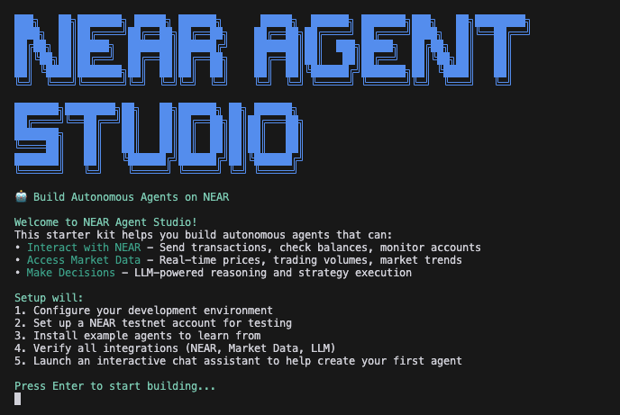

# NEAR AI Agent Studio

A production-ready starter kit for building AI agents and multi-agent swarms on NEAR. This template provides the essential building blocks for creating autonomous agents that can interact with the NEAR blockchain, make decisions using LLMs, and collaborate in swarms. The NEAR AI Agent Studio is an educational and interactive starter kit designed for developers looking to build AI agents and agentic applications on NEAR.

<div align="center">

[](https://opensource.org/licenses/MIT)
[](https://near.org)
[](https://github.com/near/near-ai-agent-template/actions)
[](https://www.python.org/downloads/)
[](https://pypi.org/project/near-swarm/)
[](https://hyperbolic.xyz)
[](https://www.lavanet.xyz/get-started/near)



</div>

## ⚡️ Getting Started

### Prerequisites

Before you begin, ensure you have:

#### System Requirements

- Python 3.12 or higher
- Git
- Operating System:
  - macOS 12.0+
  - Ubuntu 20.04+ / Debian 11+
  - Windows 10/11 with WSL2

#### NEAR Account

- NEAR testnet account (created automatically by [quickstart](./scripts/quickstart.sh) script)
- Or existing account with:
  - Account ID
  - Full access key
  - Test NEAR tokens (available from [NEAR Faucet](https://near-faucet.io))

#### API Keys

- Hyperbolic API key for LLM capabilities
  - Sign up at [hyperbolic.xyz](https://hyperbolic.xyz)
  - Free tier available for development

### Quick Start

```bash
# Clone the repository
git clone https://github.com/jbarnes850/near-ai-agent-studio
cd near-ai-agent-studio

# Create and activate virtual environment
python -m venv venv
source venv/bin/activate  # On Windows: .\venv\Scripts\activate

# Install dependencies
pip install -e .

# Run the quickstart script
chmod +x scripts/quickstart.sh  # Make script executable
./scripts/quickstart.sh
```

The quickstart script will:

1. Set up your development environment
2. Create a NEAR testnet account
3. Install example agents
4. Launch an interactive chat assistant to help you create your first agent

### Interactive Chat

After setup, you'll enter an interactive chat session where you can:

- Create new agents with `/create agent <name>`
- Configure agents with `/config agent <name>`
- Run multiple agents together with `/run-agents`
- List available agents with `/list`
- Get help anytime with `/help`

Start the chat manually anytime:

```bash
near-swarm chat  # Regular mode
near-swarm chat --tutorial create-first-agent  # Guided tutorial
```

### Environment Setup

```bash
# Copy environment template
cp .env.example .env

# Edit .env with your credentials
# Required variables:
# - NEAR_ACCOUNT_ID=your-account.testnet
# - NEAR_PRIVATE_KEY=your-private-key
# - LLM_PROVIDER=hyperbolic
# - LLM_API_KEY=your-api-key
```

## Core Components

> **Tip**: Start with modifying the examples in `near_swarm/examples/` to understand the framework.

> **Note**: This template runs on NEAR testnet by default for safe development.
> Always test thoroughly before deploying to mainnet.

### System Architecture


The architecture combines a flexible agent system with swarm intelligence capabilities:

1. **Agent Framework Core**
   - Agent Registry for managing available plugins
   - Agent Loader for dynamic loading/unloading
   - Configuration management with validation

2. **Core Services**
   - NEAR Protocol integration
   - Market data feeds
   - LLM provider interface

3. **Agent Plugins**
   - Token Transfer agent for NEAR transactions
   - Arbitrage agent for market opportunities
   - Custom agents for specialized strategies

4. **Swarm Intelligence**
   - Swarm Agent for coordinated decision-making
   - Consensus building through multi-agent voting
   - Role-based evaluation with LLM reasoning

### Project Structure

```bash
near-swarm-intelligence/
├── near_swarm/              
│   ├── core/               
│   │   ├── agent.py       
│   │   ├── swarm_agent.py 
│   │   ├── llm_provider.py 
│   │   ├── near_integration.py 
│   │   └── config/        
│   │       ├── agent_roles.json 
│   │       └── swarm_config.json 
│   └── examples/         
│       ├── simple_strategy.py 
│       └── arbitrage_strategy.py 
├── scripts/              
├── tests/               
└── docs/                
```

## 🛠️ Development Guide

### Creating Your First Agent

```python
from near_swarm.core.agent import Agent, AgentConfig
from near_swarm.core.swarm_agent import SwarmAgent, SwarmConfig

# Configure your agent
config = AgentConfig(
    near_network="testnet",
    account_id="your-account.testnet",
    private_key="your-private-key",
    llm_provider="hyperbolic",
    llm_api_key="your-api-key"
)

# Create and start agent
agent = Agent(config)
await agent.start()

# Execute actions
result = await agent.execute_action({
    "type": "transaction",
    "params": {
        "receiver_id": "receiver.testnet",
        "amount": "1.5"
    }
})
```

### Creating a Swarm

```python
# Create swarm configuration
swarm_config = SwarmConfig(
    role="market_analyzer",
    min_confidence=0.7,
    min_votes=2,
    timeout=1.0
)

# Initialize swarm agents
main_agent = SwarmAgent(config, swarm_config)
peer_agent = SwarmAgent(config, SwarmConfig(role="risk_manager"))

# Form swarm
await main_agent.join_swarm([peer_agent])
```

## 📄 Examples

For more examples and reference implementations, check out our [examples directory](near_swarm/examples/):

- [`arbitrage_strategy.py`](near_swarm/examples/arbitrage_strategy.py) - Advanced DEX arbitrage
- [`demo.py`](near_swarm/examples/demo.py) - Interactive demo of all features

Each example includes detailed comments and demonstrates different aspects of the framework.
See our [Examples Guide](docs/tutorial.md) for detailed walkthroughs.

## 📖 Documentation

- [Core Concepts](docs/core-concepts.md)
- [Tutorial](docs/tutorial.md)
- [Troubleshooting](docs/troubleshooting.md)

## 🤝 Contributing

We welcome contributions! Please see our [Contributing Guidelines](CONTRIBUTING.md).

## 📄 License

This project is licensed under the MIT License - see the [LICENSE](LICENSE) file for details.

---

Built with ❤️ by the NEAR community
