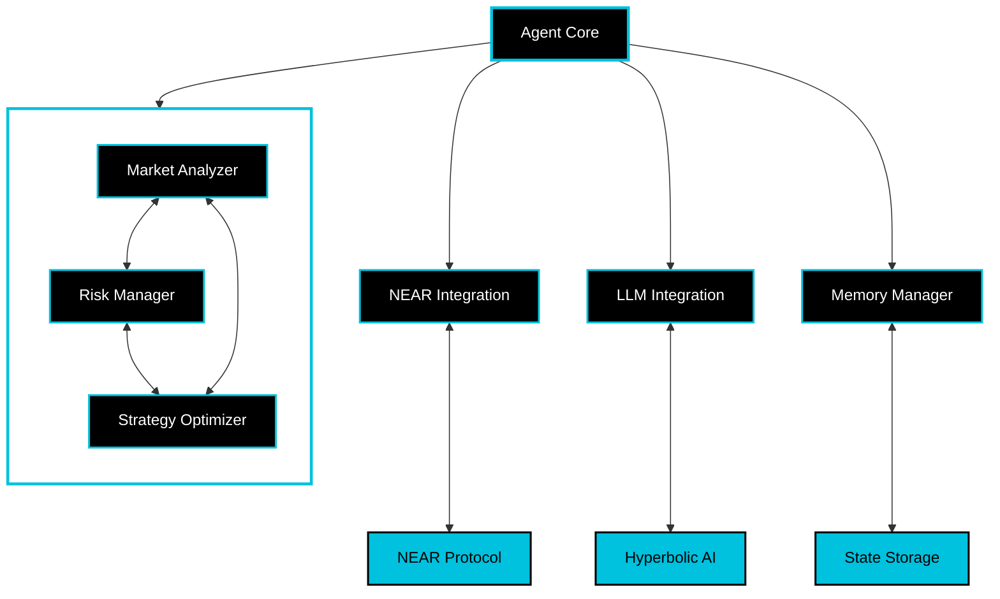

# NEAR Swarm Intelligence Framework

A production-ready starter kit for building AI-powered agents and multi-agent swarm intelligence on NEAR. This template provides the essential building blocks for creating autonomous agents that can interact with the NEAR blockchain, make decisions using LLMs, and collaborate in swarms.

[](https://opensource.org/licenses/MIT)
[](https://near.org)
[](https://github.com/near/near-ai-agent-template/actions)
[](https://www.python.org/downloads/)
[](https://hyperbolic.ai)

## 🧠 What is Swarm Intelligence?

Swarm intelligence is a collaborative decision-making approach where multiple specialized agents work together to achieve better outcomes than any single agent could alone. In this framework:

- **Market Analyzer** agents evaluate price data and trading volumes
- **Risk Manager** agents assess potential risks and exposure
- **Strategy Optimizer** agents fine-tune execution parameters

These agents collaborate through a consensus mechanism, where each agent:

1. Evaluates proposals based on its expertise
2. Provides a confidence score with its decision
3. Explains its reasoning

Collectively, the swarm makes decisions that are more informed and less risky than any single agent could achieve and executes transactions on the NEAR blockchain.

## ⚡️ Quick Start

```bash
# Clone the repository
git clone https://github.com/jbarnes850/near-swarm-intelligence
cd near-swarm-intelligence

# Run the quickstart script
./scripts/quickstart.sh

The quickstart script will:

- Set up your Python environment
- Install dependencies
- Create a NEAR testnet account
- Configure your environment
- Create an example strategy
- Guide you through using the CLI
```

> **Note**: This template runs on NEAR testnet by default for safe development.
> Always test thoroughly before deploying to mainnet.

## System Architecture



## 🎯 Key Features

### Multi-Agent Framework

- **Specialized Agents**: Each agent has a specific role and expertise
- **Consensus Mechanism**: Weighted voting system based on agent confidence
- **Collaborative Decisions**: Agents work together to evaluate opportunities
- **Transparent Reasoning**: Each agent explains its decision rationale

### NEAR Integration

- **Automated Setup**: Quick wallet creation and configuration
- **Transaction Safety**: Built-in validation and error handling
- **Market Access**: Ready-to-use interfaces for DEX interactions

## Project Structure

```bash
near-swarm-intelligence/
├── near_swarm/              # Core package
│   ├── core/               # Core components
│   │   ├── agent.py       # Base agent implementation
│   │   ├── swarm_agent.py # Swarm intelligence
│   │   └── ...
│   └── examples/          # Example implementations
├── scripts/               # Utility scripts
├── tests/                # Test suite
└── docs/                 # Documentation
```

## Example: Creating Your First Agent

```python
from near_swarm.core.agent import NEARAgent, AgentConfig
from near_swarm.core.swarm_agent import SwarmAgent, SwarmConfig

# Configure your agent
config = AgentConfig(
    near_network="testnet",
    account_id="your-account.testnet",
    private_key="your-private-key",
    llm_provider="hyperbolic",
    llm_api_key="your-api-key"
)

# Create and start agent
agent = NEARAgent(config)
await agent.start()

# Execute actions
result = await agent.execute_action({
    "type": "transaction",
    "params": {
        "receiver_id": "receiver.testnet",
        "amount": "1.5"
    }
})
```

## Creating a Swarm

```python
# Create swarm configuration
swarm_config = SwarmConfig(
    role="market_analyzer",
    min_confidence=0.7,
    min_votes=2,
    timeout=1.0
)

# Initialize swarm agents
main_agent = SwarmAgent(config, swarm_config)
peer_agent = SwarmAgent(config, SwarmConfig(role="risk_manager"))

# Form swarm
await main_agent.join_swarm([peer_agent])
```

## Testing

Run the test suite:

```bash
pytest tests/ -v
```

## Documentation

- [Core Concepts](docs/core-concepts.md)
- [First Strategy](docs/first-strategy.md)
- [Tutorial](docs/tutorial.md)
- [Troubleshooting](docs/troubleshooting.md)

## Contributing

We welcome contributions! Please see our [Contributing Guidelines](CONTRIBUTING.md).

## License

This project is licensed under the MIT License - see the [LICENSE](LICENSE) file for details.

---

Built with ❤️ by the NEAR community
