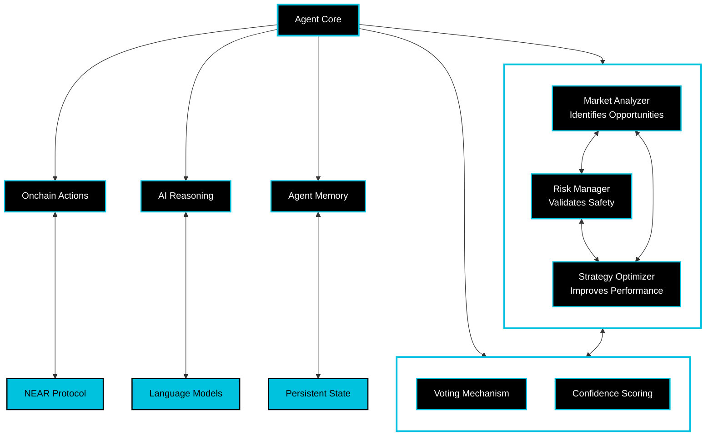

# NEAR Swarm Intelligence Framework

A production-ready starter kit for building AI-powered agents and multi-agent swarm intelligence on NEAR. This template provides the essential building blocks for creating autonomous agents that can interact with the NEAR blockchain, make decisions using LLMs, and collaborate in swarms.

[](https://opensource.org/licenses/MIT)
[](https://near.org)
[](https://github.com/near/near-ai-agent-template/actions)
[](https://www.python.org/downloads/)
[](https://hyperbolic.ai)
[](https://badge.fury.io/py/near-swarm)
[](https://near-swarm.readthedocs.io/en/latest/?badge=latest)

## 🧠 What is Swarm Intelligence?

Swarm intelligence is a collaborative decision-making approach where multiple specialized agents work together to achieve better outcomes than any single agent could alone. In this framework:

- **Market Analyzer** agents evaluate price data and trading volumes
- **Risk Manager** agents assess potential risks and exposure
- **Strategy Optimizer** agents fine-tune execution parameters

These agents collaborate through a consensus mechanism, where each agent:

1. Evaluates proposals based on its expertise
2. Provides a confidence score with its decision
3. Explains its reasoning

Collectively, the swarm makes decisions that are more informed and less risky than any single agent could achieve and executes transactions on the NEAR blockchain.

## ⚡️ Quick Start

```bash
# Clone the repository
git clone https://github.com/jbarnes850/near-swarm-intelligence
cd near-swarm-intelligence

# Run the quickstart script
./scripts/quickstart.sh

The quickstart script will:
- Set up your Python environment
- Install dependencies
- Create a NEAR testnet account
- Configure your environment
- Create an example strategy
- Guide you through using the CLI
```

**Configure Environment**
```bash
# Copy and edit environment variables
cp .env.example .env

> **Tip**: Start with modifying the examples in `near_swarm/examples/` to understand the framework.

> **Note**: This template runs on NEAR testnet by default for safe development.
> Always test thoroughly before deploying to mainnet.

## System Architecture



## 🎯 Key Features

### Multi-Agent Framework

- **Specialized Agents**: Each agent has a specific role and expertise
- **Consensus Mechanism**: Weighted voting system based on agent confidence
- **Collaborative Decisions**: Agents work together to evaluate opportunities
- **Transparent Reasoning**: Each agent explains its decision rationale

### NEAR Integration

- **Automated Setup**: Quick wallet creation and configuration
- **Transaction Safety**: Built-in validation and error handling
- **Market Access**: Ready-to-use interfaces for DEX interactions

## Project Structure

```bash
near-swarm-intelligence/
├── near_swarm/              # Core package
│   ├── core/               # Core components
│   │   ├── agent.py       # Base agent implementation
│   │   ├── swarm_agent.py # Swarm intelligence
│   │   ├── llm_provider.py # LLM integration
│   │   ├── near_integration.py # NEAR blockchain integration
│   │   └── config/        # Default configurations
│   │       ├── agent_roles.json # Agent role definitions
│   │       └── swarm_config.json # Swarm strategy configs
│   └── examples/          # Example implementations
│       ├── simple_strategy.py # Basic multi-agent example
│       └── arbitrage_strategy.py # DEX arbitrage example
├── scripts/               # Utility scripts
├── tests/                # Test suite
└── docs/                 # Documentation
```

## Examples

### Simple Transfer Strategy
The basic example (`simple_strategy.py`) demonstrates LLM-powered multi-agent decision making for a simple NEAR transfer:

```python
# Initialize specialized agents
market_analyzer = SwarmAgent(config, SwarmConfig(role="market_analyzer"))
risk_manager = SwarmAgent(config, SwarmConfig(role="risk_manager"))
strategy_optimizer = SwarmAgent(config, SwarmConfig(role="strategy_optimizer"))

# Form swarm network
await market_analyzer.join_swarm([risk_manager, strategy_optimizer])

# Example proposal with market context
proposal = {
    "type": "transfer",
    "params": {
        "recipient": "bob.testnet",
        "amount": "0.1",
        "token": "NEAR",
        "market_context": {
            "current_price": 5.45,
            "24h_volume": "2.1M",
            "market_trend": "upward"
        }
    }
}
```

### DEX Arbitrage Strategy
The advanced example (`arbitrage_strategy.py`) shows how to build a DEX arbitrage strategy with market data integration:

```python
# Get market data
near_data = await market.get_token_price('near')
dex_data = await market.get_dex_data('ref-finance')

# Initialize specialized agents
market_analyzer = SwarmAgent(config, SwarmConfig(
    role="market_analyzer",
    min_confidence=0.7
))
risk_manager = SwarmAgent(config, SwarmConfig(
    role="risk_manager",
    min_confidence=0.8  # Higher threshold for risk
))

# Analyze opportunity
opportunity = await market.analyze_market_opportunity(
    token_pair='NEAR/USDC',
    amount=100,
    max_slippage=0.01
)

# Get swarm consensus
consensus = await market_analyzer.propose_action(
    action_type="market_trade",
    params={
        "pair": "NEAR/USDC",
        "action": "buy" if opportunity["analysis"]["is_opportunity"] else "skip",
        "amount": 100,
        "price_impact": opportunity["analysis"]["price_impact"]
    }
)
```

## Example: Creating Your First Agent

```python
from near_swarm.core.agent import Agent, AgentConfig
from near_swarm.core.swarm_agent import SwarmAgent, SwarmConfig

# Configure your agent
config = AgentConfig(
    near_network="testnet",
    account_id="your-account.testnet",
    private_key="your-private-key",
    llm_provider="hyperbolic",
    llm_api_key="your-api-key"
)

# Create and start agent
agent = Agent(config)
await agent.start()

# Execute actions
result = await agent.execute_action({
    "type": "transaction",
    "params": {
        "receiver_id": "receiver.testnet",
        "amount": "1.5"
    }
})
```

## Creating a Swarm

```python
# Create swarm configuration
swarm_config = SwarmConfig(
    role="market_analyzer",
    min_confidence=0.7,
    min_votes=2,
    timeout=1.0
)

# Initialize swarm agents
main_agent = SwarmAgent(config, swarm_config)
peer_agent = SwarmAgent(config, SwarmConfig(role="risk_manager"))

# Form swarm
await main_agent.join_swarm([peer_agent])
```

## Testing

Run the test suite:

```bash
pytest tests/ -v
```

## Chat Mode

The NEAR Swarm Intelligence Framework includes a powerful interactive chat interface for communicating with your agents:

```bash
# Start chatting with your AI assistant
./scripts/chat

# Or use specific options if needed:
./scripts/chat --agent market_analyzer  # Chat with market analysis agent
./scripts/chat --multi-agent            # Enable multi-agent mode
./scripts/chat --verbose               # Show detailed reasoning
```

The chat interface provides:
- Natural language interaction with AI agents
- Market analysis and trading insights
- Risk assessment and portfolio management
- Strategy optimization suggestions

Just type your questions or commands naturally, for example:
- "What's the current market sentiment for NEAR?"
- "Analyze the trading volume in the last 24 hours"
- "Help me understand the risks in my current position"

Use `/help` to see all available commands.

### Chat Commands

- **Market Analysis**
  - `/market [symbol]` - Get market analysis
  - `/trend [timeframe]` - Get trend analysis
  - `/volume [symbol]` - Volume analysis

- **Risk Management**
  - `/risk [action]` - Risk assessment
  - `/balance` - Check portfolio balance
  - `/positions` - List open positions

- **Strategy**
  - `/strategy [action]` - Strategy suggestions
  - `/portfolio` - Portfolio overview

- **Development Tools**
  - `/ws` - Manage workspace configuration
  - `/env` - Configure environment variables
  - `/config` - View/modify settings
  - `/reason` - Toggle step-by-step reasoning
  - `/multiline` - Toggle multiline input mode
  - `/save` - Save chat history
  - `/load` - Load chat history

### Natural Language Interaction

Agents understand natural language queries:
```bash
> What's the current market sentiment for NEAR?
> Should I adjust my portfolio based on current trends?
> Help me implement a simple arbitrage strategy
```

### Workspace Management

```bash
# Create a workspace
> /ws create trading_bot
Description: My NEAR trading bot workspace

# Configure environment
> /env set NEAR_NETWORK=mainnet
> /env set RISK_THRESHOLD=0.7

# Export workspace
> /export my_workspace.json

# Import in another session
> /import my_workspace.json
```

### Structured Outputs

Agents provide structured responses using Pydantic models:

```python
# Market Analysis Response
{
    "price": 5.45,
    "sentiment": "bullish",
    "volume_24h": "2.1M",
    "trend": "upward",
    "confidence": 0.85,
    "reasoning": "Strong buying pressure...",
    "recommendations": [
        "Consider increasing position",
        "Set stop loss at $5.20"
    ]
}
```

### Multi-Agent Swarm Mode

Enable multiple agents to collaborate:
```bash
near-swarm chat -i --multi-agent --agents market_analyzer risk_manager strategy_optimizer
```

Each agent contributes its expertise:
- Market Analyzer evaluates opportunities
- Risk Manager assesses potential risks
- Strategy Optimizer suggests improvements

## Documentation

- [Core Concepts](docs/core-concepts.md)
- [First Strategy](docs/first-strategy.md)
- [Tutorial](docs/tutorial.md)
- [Troubleshooting](docs/troubleshooting.md)

## Contributing

We welcome contributions! Please see our [Contributing Guidelines](CONTRIBUTING.md).

## License

This project is licensed under the MIT License - see the [LICENSE](LICENSE) file for details.

---

Built with ❤️ by the NEAR community
